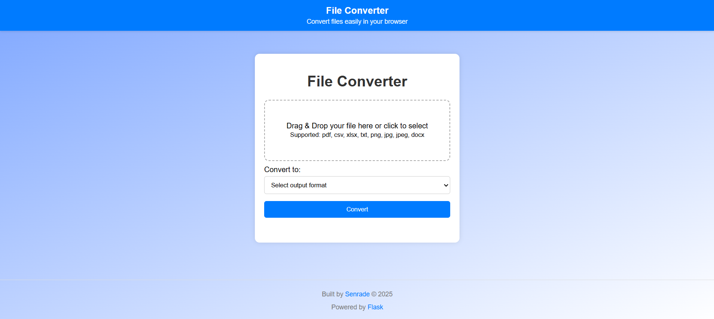
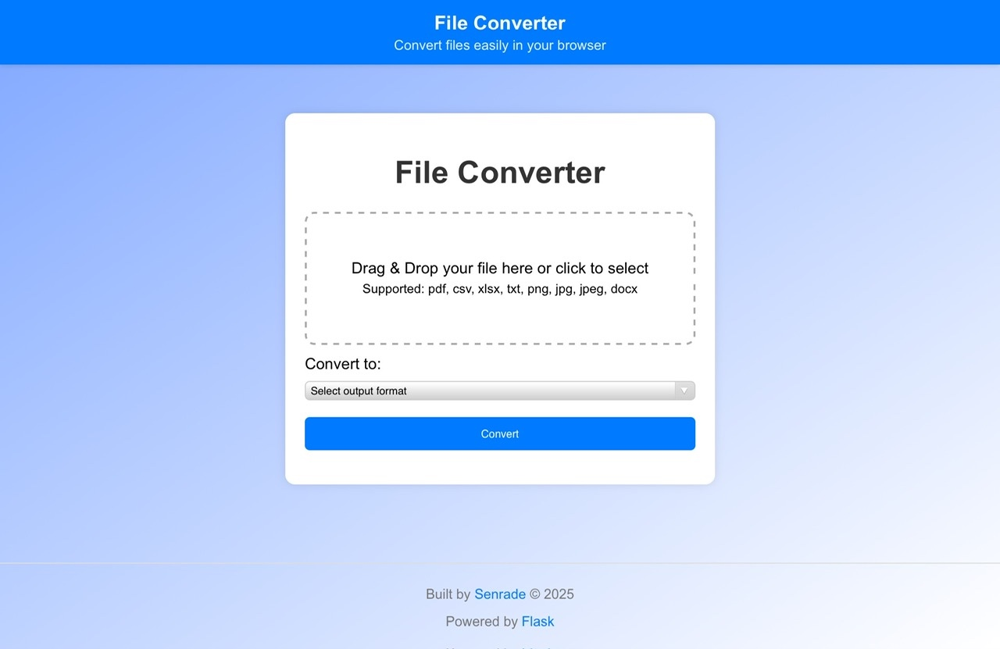
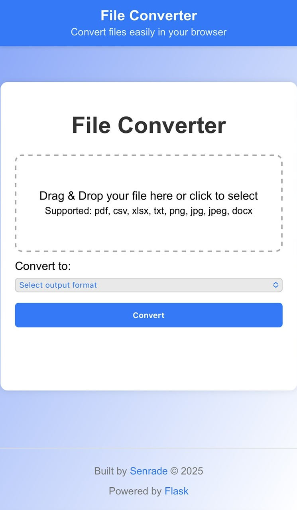

# File Converter (Flask)

A lightweight Flask web application for converting files between multiple formats with built‑in validation to prevent invalid conversions.

## Supported Features
- **Supported input formats:** `pdf`, `csv`, `xlsx`, `txt`, `png`, `jpg`, `docx`
- **Conversion rules** enforce only valid source–target pairs (e.g., PNG → TXT is blocked)
- **Drag & Drop** file upload with click fallback
- **Dynamic output format list** based on uploaded file type
- **Responsive design** for desktop and mobile

---
## Visual

### Desktop View


### Tablet View


### Mobile View


---

## Installation

### 1. Clone the repository
```bash
git clone https://github.com/yourusername/file-converter.git
cd file-converter
```

2. Create and activate a virtual environment
```bash
    python -m venv venv
```

- Activate:
    #In MacOS or Linux
    source venv/bin/activate

    #In CMD
    venv\Scripts\activate.bat

    #If using Powershell, doing the same in your IDE as well
    venv\Scripts\Activate.ps1

    you should see "(venv)" before your current directory.

3. Install dependencies

    pip install -r requirements.txt

---

## USAGE

1. Run the application

    python app.py

2. Access in browser

    * Running on http://127.0.0.1:5000        # Localhost, accessible only from this machine
    * Running on http://192.168.100.5:5000    # LAN IP, accessible from devices on the same network

    Open either URL as needed.

---

## Project Structure

file_converter/
│
├── app.py
├── requirements.txt
├── README.md
├── .gitignore
├── static/
│   ├── style.css
│   └── script.js
└── templates/
    └── index.html

---

## License
This project is licensed under the MIT License.